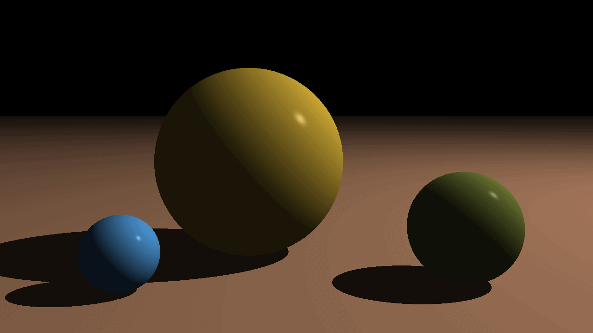

# RayTracer

A **Whitted-style Backward Ray Tracer** built from scratch in C++.

## Running

- Run `run.sh` to render the sample scene defined in `main.cpp`. Renders will be placed inside `build/` directory.
- Run `test.sh` to execute Unit Tests.
- Run `clean.sh` to clear the build directory.

## What's done

- Math primitives (tuple, point, vector, color, materials).
- Matrix transforms and operations.
- Camera and canvas.
- Sphere and plane geometry.
- Point lights and Phong lighting.
- Ray generation and intersection logic.
- World assembly and shading pipeline.

## What's left

Reflections, refractions, bounding boxes, glTF model support.
